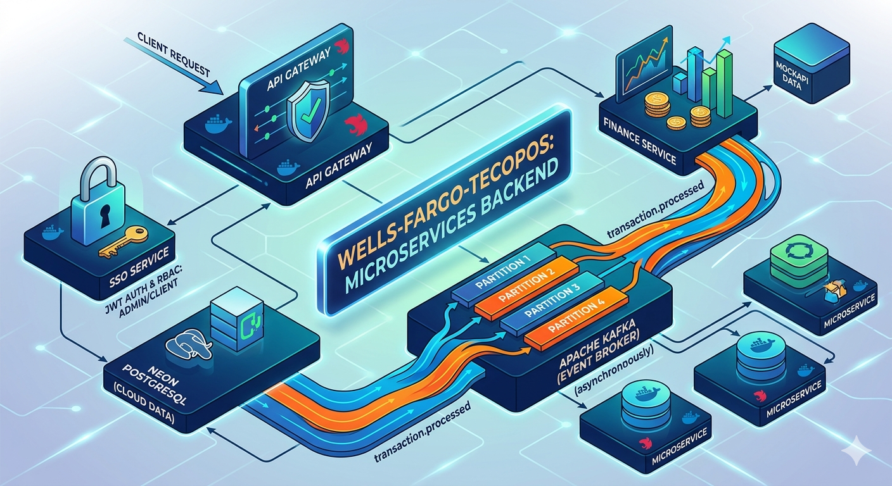
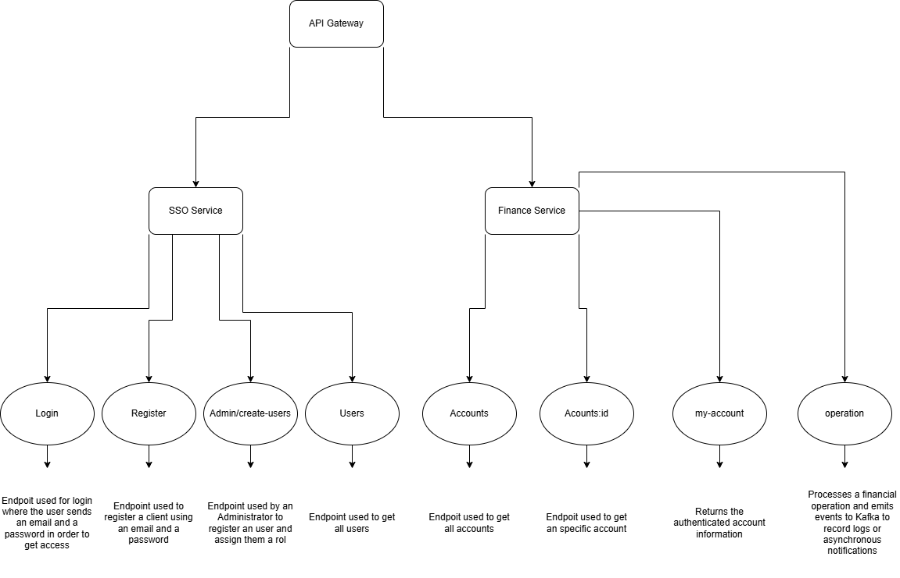

# 🏦 Wells-Fargo-Tecopos

Este repositorio contiene la arquitectura backend del proyecto **Wells-Fargo-Tecopos**, un monorepositorio de microservicios desarrollado con **NestJS**.  
El sistema integra comunicación orientada a eventos con **Apache Kafka**, persistencia en la nube con **Neon (PostgreSQL)** y consumo de datos externos mediante **MockAPI**.

---

## 🏗️ Arquitectura del Sistema

El sistema se basa en una arquitectura desacoplada para garantizar escalabilidad y mantenimiento independiente:

### 🌐 API Gateway (`api-gateway`)
Punto de entrada único del sistema. Gestiona:
- Enrutamiento de solicitudes.
- Seguridad perimetral.
- Rate Limiting con **Throttler** para proteger los servicios internos.

### 🔐 SSO Service (`sso-service`)
Centro de identidad y acceso. Gestiona:
- Usuarios.
- Hashing de contraseñas con **Bcrypt**.
- Emisión de **JWT**.

#### RBAC (Role-Based Access Control)
Diferencia entre niveles de acceso:
- **Admin**: gestión total.
- **Cliente**: operaciones de usuario.

### 💰 Finance Service (`finance-service`)
Núcleo de lógica financiera. Se encarga de:
- Consumir datos de **MockAPI**.
- Procesar transacciones.
- Emitir eventos a **Kafka** para notificar cambios de forma asíncrona.

---

## 🛠️ Stack Tecnológico

- **Framework:** NestJS (Node.js / TypeScript)
- **Mensajería:** Apache Kafka (`kafkajs`)
- **Base de Datos:** PostgreSQL alojado en Neon.tech
- **Integraciones:** MockAPI
- **Seguridad:** Passport JWT, Bcrypt, NestJS Throttler
- **Infraestructura:** Docker & Docker Compose

---

## 🚀 Configuración del Entorno

### 1. Requisitos Previos

Asegúrate de tener instalado:

- Node.js v18+
- Docker Desktop
- Apache Kafka instalado localmente para ejecución nativa en Windows

### 2. Variables de Entorno

Crea un archivo `.env` en la raíz del proyecto con esta estructura:

```env
# Base de Datos (Neon)
DATABASE_URL=postgresql://<user>:<pass>@<host>.neon.tech/tecopos_db?sslmode=require

# Infraestructura Local
KAFKA_BROKER=127.0.0.1:9092
POSTGRES_HOST_PORT=5432

# Seguridad
JWT_SECRET=tu_secreto_para_tokens

# Servicios
API_GATEWAY_PORT=3000
SSO_PORT=3001
FINANCE_PORT=3002
MOCK_API_URL=https://<id>.mockapi.io/api/v1
```

---

## 📦 Ejecución con Docker

Si prefieres levantar la infraestructura rápidamente con contenedores:

```bash
# Iniciar servicios de infraestructura
docker compose up -d postgres kafka

# Iniciar todo el ecosistema (Servicios + Infra)
docker compose up --build
```

---

## 🏃‍♂️ Ejecución en Desarrollo Local (Windows)

Para trabajar en local y ver los logs en tiempo real de todos los microservicios:

### Paso 1: Iniciar Kafka

Abre una terminal y ejecuta el broker de Kafka:

```dos
.\bin\windows\kafka-server-start.bat .\config\server.properties
```

> Asegúrate de tener Zookeeper activo si tu versión de Kafka lo requiere.

### Paso 2: Iniciar Microservicios

En la raíz del proyecto, instala dependencias y ejecuta:

```bash
npm install
npm run start:all
```

Este comando usa `concurrently` para ejecutar el Gateway, SSO y Finance Service al mismo tiempo.

---
## 🌐 Enlaces Desplegados (Producción)

**IMPORTANTE:** Antes de usar estos enlaces, debes hacer **1 cambio clave** en el proyecto:

### 🔧 Configuración OBLIGATORIA para Railway

En cada servicio (`main.ts`), cambia esta línea:

```ts
// ❌ LOCAL (no funciona en Railway)
await app.listen(3000);

// ✅ PRODUCCIÓN (Railway)
const port = process.env.PORT || 3000;
await app.listen(port, '0.0.0.0');
```

**Local lo dejamos como está** (`localhost:3000`), pero para Railway usa `0.0.0.0` y `process.env.PORT`.

---

Una vez hecho el cambio:

| Servicio | URL |
|----------|-----|
| **API Gateway** | `https://api-gateway-production-25b6.up.railway.app` |
| **SSO Service** | `https://sso-service-production-c161.up.railway.app` |
| **Finance Service** | `https://finance-service-production-86e8.up.railway.app` |

---

## 📡 API Gateway y Endpoints

La API Gateway expone los servicios principales del sistema en una sola entrada.

Accede a la documentación interactiva en:

```bash
http://localhost:3000/api
```

---

## 🔐 Autenticación (SSO)

### `POST /api/v1/auth/register`
Registro de usuarios nuevos con rol `USER` por defecto.

**Body ejemplo:**
```json
{
  "email": "adminhey@wellsfargo.com",
  "password": "password123"
}
```

**Respuesta esperada:**
```json
{
  "id": 11,
  "email": "adminhey@wellsfargo.com",
  "password": "$2b$10$SI4bY0P5fdFBz8Bb1P/uZ.Hf6kT11dw2Kb0WEyvutzMJlbNaUTBve",
  "role": "USER"
}
```

---

### `POST /api/v1/auth/login`
Inicia sesión y devuelve un token JWT para acceder a rutas protegidas.

**Body ejemplo:**
```json
{
  "email": "adminhey@wellsfargo.com",
  "password": "password123"
}
```

---

### `GET /api/v1/auth/users`
Devuelve todas las cuentas registradas.

**Acceso:** solo `ADMIN`.

---

### `POST /api/v1/auth/admin/create-user`
Ruta exclusiva para `ADMIN`.

Esta ruta permite crear usuarios y asignar roles manualmente.

**Uso principal:**
- Crear cuentas con rol `ADMIN`.
- Crear cuentas con rol `USER`.
- Gestionar accesos desde panel administrativo.

---

## 👤 Cuentas y Perfil

### `GET /api/v1/accounts`
Devuelve todas las cuentas almacenadas en la base de datos.

**Acceso:** solo `ADMIN`.

---

### `GET /api/v1/accounts/:id`
Devuelve una cuenta específica por ID.

**Acceso:** solo `ADMIN`.

**Ejemplo:**
```bash
http://localhost:3000/api/v1/accounts/2
```

---

### `GET /api/v1/accounts/my-account`
Devuelve la información de la cuenta autenticada.

**Acceso:** cualquier usuario logueado con token Bearer válido.

**Header requerido:**
```http
Authorization: Bearer <token_jwt>
```

---

## 💰 Operaciones Financieras

### `POST /api/v1/accounts/operation`
Procesa una operación financiera y emite eventos a **Kafka** para registrar logs o notificaciones asíncronas.

**Body ejemplo:**
```json
{
  "type": "PAYMENT",
  "amount": 50.00,
  "description": "Pago de servicios en monedero TECOPOS"
}
```

### Tipos de operación

DEPOSIT — Dinero que entra a la cuenta.

WITHDRAWAL — Dinero que sale de la cuenta.

TRANSFER_IN — Transferencia recibida desde otra cuenta.

TRANSFER_OUT — Transferencia enviada hacia otra cuenta.

PAYMENT — Pago realizado por un servicio, compra o gasto


## 🔐 Seguridad y Roles

El sistema usa autenticación con JWT y autorización basada en roles:

- **USER**: puede iniciar sesión, consultar su cuenta y realizar acciones permitidas.
- **ADMIN**: puede ver todos los usuarios, todas las cuentas y crear usuarios con roles.

Todos los endpoints protegidos requieren el header:

```http
Authorization: Bearer <token_jwt>
```

---

## 🧩 Kafka en Operaciones

Cuando se ejecuta una operación financiera:
1. El servicio valida los datos.
2. Actualiza la información en la base de datos.
3. Publica un evento en **Kafka**.
4. Los consumidores pueden registrar logs, auditorías o notificaciones.

Esto permite una arquitectura desacoplada y escalable.

---

## 📌 Resumen de Endpoints

| Método | Endpoint | Acceso | Descripción |
|---|---|---|---|
| POST | `/api/v1/auth/register` | Público | Registro de usuario con rol por defecto |
| POST | `/api/v1/auth/login` | Público | Login y generación de JWT |
| GET | `/api/v1/auth/users` | ADMIN | Lista todas las cuentas |
| POST | `/api/v1/auth/admin/create-user` | ADMIN | Crear usuario y asignar rol |
| GET | `/api/v1/accounts` | ADMIN | Lista todas las cuentas |
| GET | `/api/v1/accounts/:id` | ADMIN | Consulta cuenta por ID |
| GET | `/api/v1/accounts/my-account` | Auth | Consulta la cuenta autenticada |
| POST | `/api/v1/accounts/operation` | Auth | Procesa operación financiera y emite evento Kafka |

## 📁 Estructura General

```bash
Wells-Fargo-Tecopos/
├── apps/
│   ├── api-gateway/
│   ├── sso-service/
│   └── finance-service/
├── libs/
├── docker-compose.yml
├── package.json
└── .env
```

---


## 📌 Notas

- Este proyecto está pensado como una arquitectura de microservicios desacoplada.
- Kafka se utiliza para comunicación asíncrona entre servicios.
- Neon actúa como base de datos PostgreSQL en la nube.
- MockAPI permite simular datos externos durante desarrollo y pruebas.

---
